# LAMP-stack-project-on-AWS
This repo contains steps and config files for setting up a LAMP stack (Linux, Apache, MySQL, PHP) on an AWS EC2 instance. It covers instance setup, server security, Apache and MySQL config, and deploying a sample PHP app. Perfect for beginners learning cloud-based web hosting.

## Introduction to LAMP stack  
LAMP stands for Linux, Apache, MySQL, and PHP. It is a popular open-source stack used to build and run dynamic websites and web applications. <MARK>Linux is the operating system, Apache is the web server, MySQL handles the database, and PHP is the scripting language that runs the site logic.

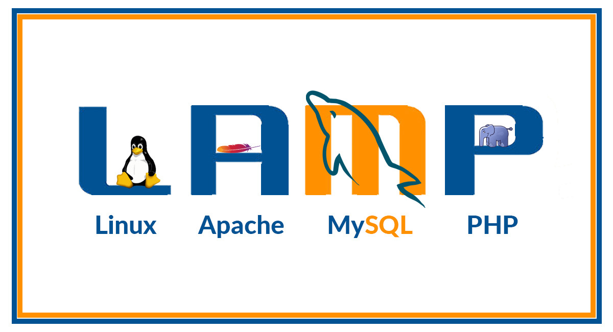

One advantage of LAMP is the substantial flexibility for different database, web server, and scripting languages. Popular substitutes for MySQL include SQLite and PostgreSQL. PHP can be replaced with Python, Perl while Nginx, Cherokee and Lighttpd can replace Apache in other web stack implementations like the LEMP application stack.

For this LAMP stack project Linux, APache, MySQL and PHP will be used. All four of these technologies are open source, which means they are community maintained and freely available for anyone to use. Developers use LAMP stacks to create, host, and maintain web content. It is a popular solution that powers many of the websites you commonly use today. To read more about LAMP stack, checkout this AWS documentation.

## Importance of LAMP Stack  
The LAMP stack is used for backend (server-side) development. This means it powers software that operates behind the scenes, hidden from the end user.

A typical backend application includes:  
1. Data processing software.
2. Database components for storing and retrieving .data.
3. Business logic written in code to handle operations and decisions.
4. An API (Application Programming Interface) for communication with other applications or front-end systems.

### The webpage displayed in your browser is known as the frontend application. When you interact with it, for example by clicking a button, your browser sends a request to the backend application, which processes the request and returns the necessary information.

<mark>Developers use the LAMP stack to build both static and dynamic web content:  

**Static Webpages**  
Static webpages display the same content to all users.
For example, a company's contact address is static content.
These pages are built with HTML and CSS, then stored as files on the web server.  

**Dynamic Webpages**  
Dynamic webpages show different content based on the user or other factors.
For example, a greeting message that changes based on your location.
To deliver this, the web server uses backend logic and database queries to generate the content dynamically.

# Implementing The Lamp Stack on AWS  
**Step 1:** Create a Virtual Server on AWS
Login to the AWS console
Search for EC2 (Elastic Compute Cloud)
Select your preferred region (the closest to you) and launch a new EC2 instance of t2.micro family with Ubuntu Server 24.04 LTS 
Type a name e.g My_Lamp_Server Click create a new key pair, use any name of your choice as the name for the pem file and select .pem.
Linux/Mac users, choose .pem for use with openssh. This allows you to connect to your server using open ssh clients.
For windows users choose .ppk for use with putty. Putty is a software that lets you connect remotely to servers
Save your private key (.pem file) securely and do not share it with anyone! If you lose it, you will not be able to connect to your server ever again!

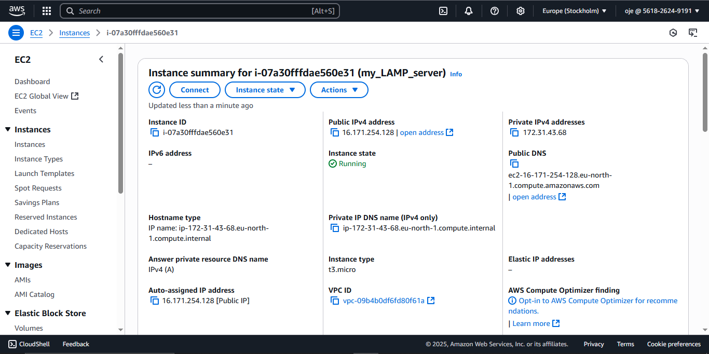

* On your local computer, open the terminal and change directory to the Downloads folder, type    
    `cd ~/Downloads`

* Change permissions for the private key file (.pem), otherwise you can get an error “Bad permission”  
  `ssh -i . pem ubuntu@`

  The public ip address of my virtual server is 16.171.254.128 as shown in the image Note: For Ubuntu server, the usernanme is ubuntu and for other servers like Fedora Amazon Machine image (AMI), the username is fedora or ec2-user.  

*Congratulations! You have just created your very first Linux Server in the Cloud and our set up looks like this now: (You are the client)*
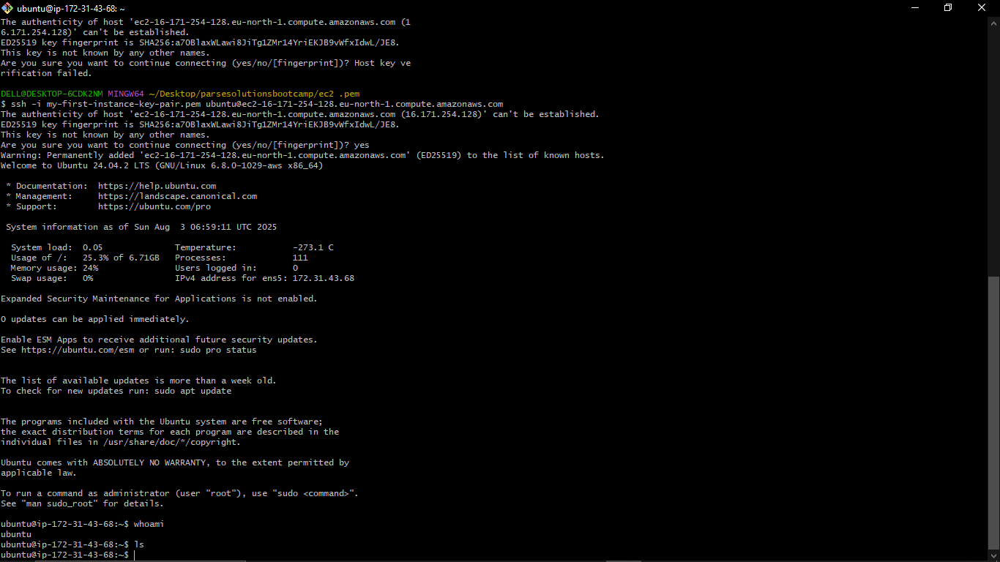
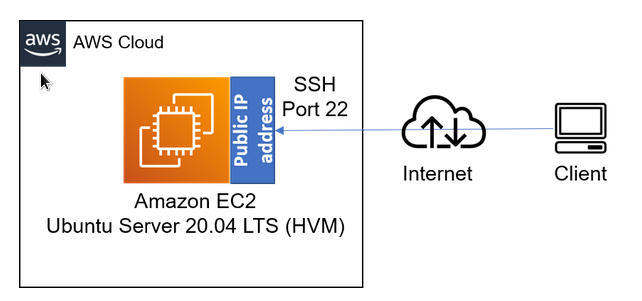

## Step 2: Installing Apache and Updating the Firewall  
The Apache HTTP Server, developed and maintained by the Apache Software Foundation, is one of the most widely used web server software in the world. It is open-source and free to use.

<mark>Apache powers around 67% of all web servers globally, thanks to its reputation for being:

* Fast

* Reliable

* Secure

* Highly customizable through extensions and modules

Because of its flexibility, many hosting providers — including most WordPress hosting platforms — use Apache as their default web server software.

1. ### Update a list of packages in package manager  
   `sudo apt update`
   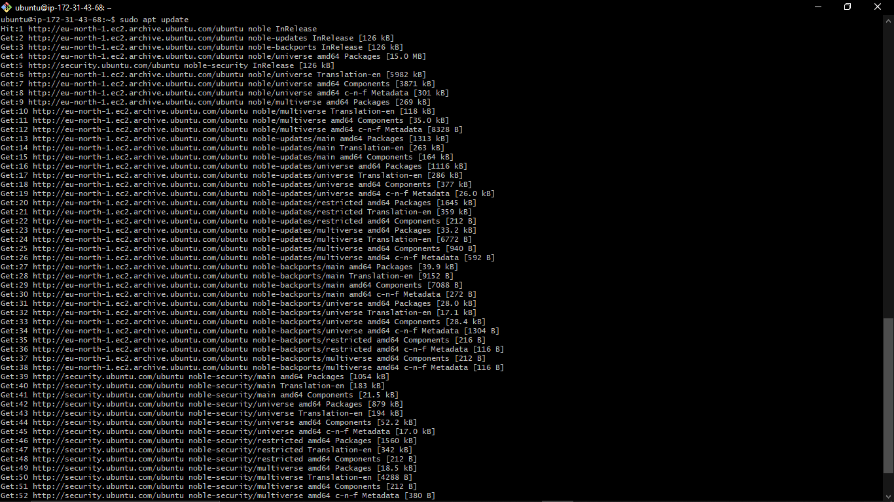  
2. ### Run apache2 package installation
   `sudo apt install apache2`
   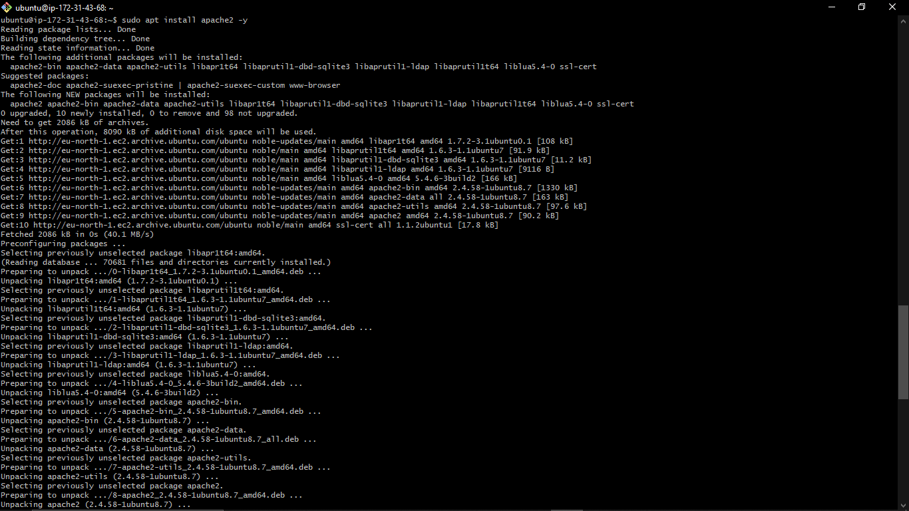  
3. ### To verify that apache2 is running as a Service
    `sudo systemctl status apache2`
    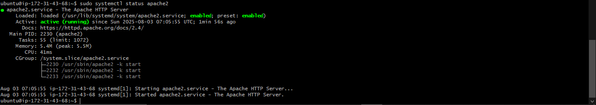   

Before we can receive any traffic by our Web Server, we need to open TCP port 80 which is the default port that web browsers use to access web pages on the Internet As we know, we have TCP port 22 open by default on our EC2 machine to access it via SSH, so we need to add a rule to EC2 configuration to open inbound connection through port 80: I configured the inbound when I was creating the virtual server 
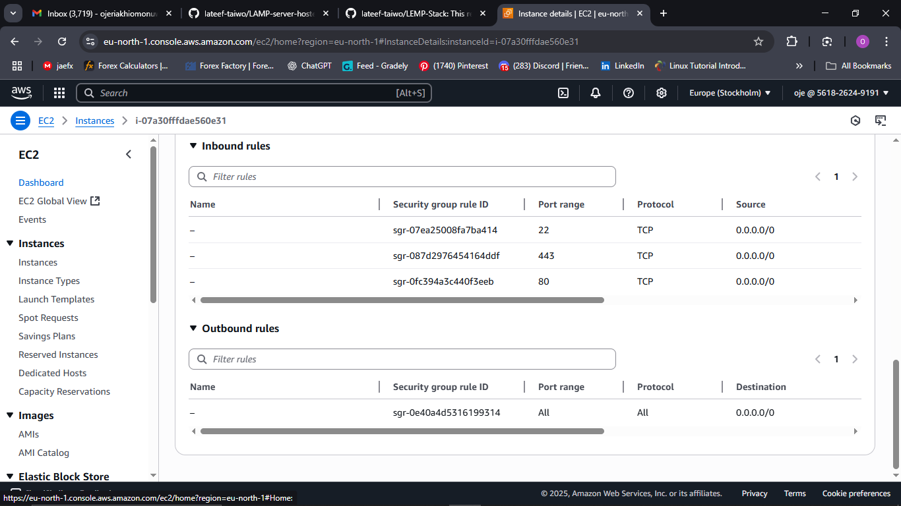

* Our server is running and we can access it locally and from the Internet (Source 0.0.0.0/0 means ‘from any IP address’). First, let us try to check how we can access it locally in our Ubuntu shell, run:  
curl [http://localhost:80](http://localhost:80) or  
 curl [http://127.0.0.1:80](http://127.0.0.1:80)

* Open a web browser of your choice and try to access following url  
http://13.40.63.137:80
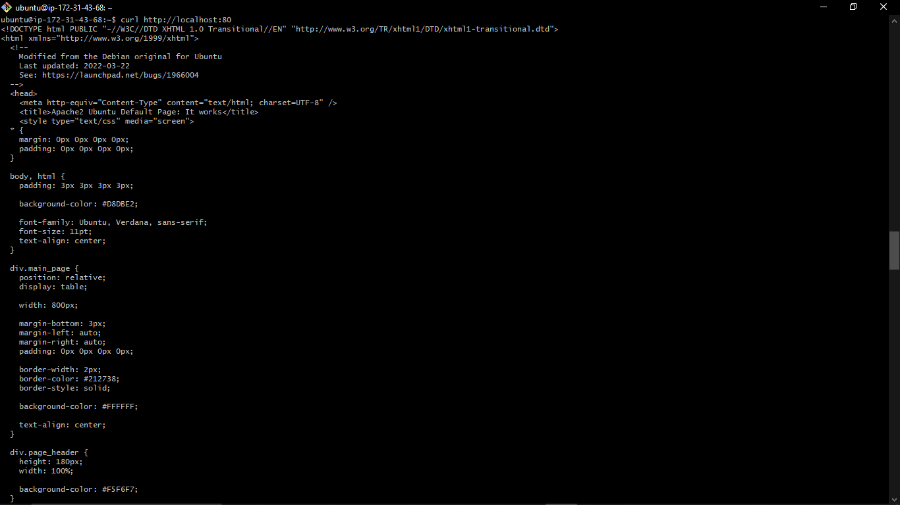
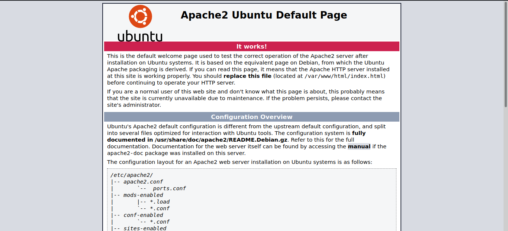

* Another way to retrieve your Public IP address, other than to check it in AWS Web console, is to use following command:
  
    `curl -s http://169.254.169.254/latest/meta-data/public-ipv4`

## Step 3: Installing Mysql
Now that you have a web server up and running, you need to install a Database Management System (DBMS) to be able to store and manage data for your site in a relational database. MySQL is a popular relational database management system used within PHP environments, so we will use it in our project. Again, use ‘apt’ to acquire and install this software:  
`$ sudo apt install mysql-server`
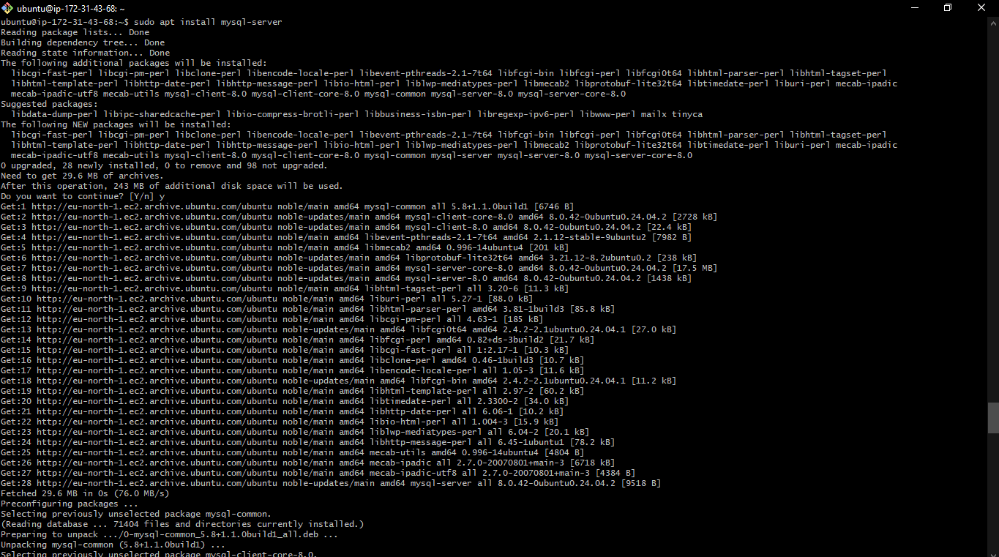

When prompted, confirm installation by typing Y, and then ENTER.

<mark>When the installation is finished, log in to the MySQL console by typing:  

 `$ sudo mysql`
 
 This will connect to the MySQL server as the administrative database user root, which is inferred by the use of sudo when running this command. You should see output like this:
 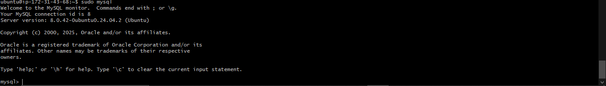

 *Type 'help;' or '\h' for help. Type '\c' to clear the current input statement.

`mysql>`

It’s recommended that you run a security script that comes pre-installed with MySQL. This script will remove some insecure default settings and lock down access to your database system. Before running the script, you will set a password for the root user, using mysql_native_password as default authentication method. We’re defining this user’s password as PassWord.1.

`ALTER USER 'root'@'localhost' IDENTIFIED WITH mysql_native_password BY 'PassWord.1';`

Exit the MySQL shell with:  
 `mysql> exit`

 Start the interactive script by running:  
`$ sudo mysql_secure_installation`

***This will ask if you want to configure the VALIDATE PASSWORD PLUGIN. Note: Enabling this feature is something of a judgment call. If enabled, passwords which don’t match the specified criteria will be rejected by MySQL with an error. It is safe to leave validation disabled, but you should always use strong, unique passwords for database credentials. Answer Y for yes, or anything else to continue without enabling.***

* ### VALIDATE PASSWORD PLUGIN  
  can be used to test passwords and improve security. It checks the strength of password and allows the users to set only those passwords which are secure enough. Would you like to setup VALIDATE PASSWORD plugin? Press y/Y for Yes, any other key for No:
If you answer “yes”, you’ll be asked to select a level of password validation. Keep in mind that if you enter 2 for the strongest level, you will receive errors when attempting to set any password which does not contain numbers, upper and lowercase letters, and special characters, or which is based on common dictionary words e.g., PassWord.1.

To exit the MySQL console, type:  
`mysql> exit`

## Step 4: Installing PHP
You have Apache installed to serve your content and MySQL installed to store and manage your data. PHP is the component of our setup that will process code to display dynamic content to the end user. In addition to the php package, you’ll need php-mysql, a PHP module that allows PHP to communicate with MySQL-based databases. You’ll also need libapache2-mod-php to enable Apache to handle PHP files. Core PHP packages will automatically be installed as dependencies. To install these 3 packages at once, run:  
`sudo apt install php libapache2-mod-php php-mysql`
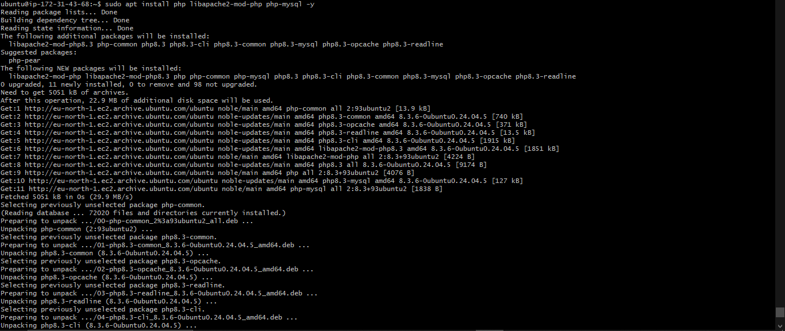

Once the installation is finished, you can run the following command to confirm your PHP version:  
`php -v`

 

  <pre>
<code id="phpVersion">
PHP 7.4.3 (cli) (built: Oct 6 2020 15:47:56) (NTS)
Copyright (c) The PHP Group
Zend Engine v3.4.0, Copyright (c) Zend Technologies
</code>
  </pre>
  <button onclick="copyPHPVersion()" title="Copy to clipboard" style="position: absolute; top: 10px; right: 10px; cursor: pointer;">📋</button>

***At this point, your LAMP stack is completely installed and fully operational.
Linux (Ubuntu)
Apache HTTP server
MySQL
PHP
To test your setup with a PHP script, it’s best to set up a proper Apache Virtual Host to hold your website’s files and folders. Virtual host allows you to have multiple websites located on a single machine and users of the websites will not even notice it.***

## Step 5: Creating a Virtual Host For your website using Apache
In this project, you will set up a domain called projectlamp, but you can replace this with any domain of your choice. Apache on Ubuntu 24.04 has one server block enabled by default that is configured to serve documents from the `/var/www/html` directory. We will leave this configuration as is and will add our own directory next next to the default one. Create the directory for projectlamp using `mkdir` command as follows:  
`sudo mkdir /var/www/projectlamp`

Next, assign ownership of the directory with your current system user:

`sudo chown -R $USER:$USER /var/www/projectlamp`
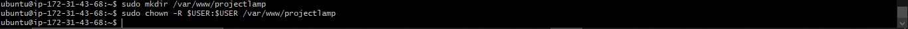
Then, create and open a new configuration file in Apache’s sites-available directory using your preferred command-line editor. Here, we’ll be using vi or vim (They are the same by the way):

`sudo vi /etc/apache2/sites-available/projectlamp.conf`

`sudo vim /etc/apache2/sites-available/projectlamp.conf`

This will create a new blank file. Paste in the following bare-bones configuration by hitting on i on the keyboard to enter the insert mode, and paste the text:

  <pre>
<code id="vhostConfig">
&lt;VirtualHost *:80&gt;
    ServerName projectlamp.local
    ServerAlias www.projectlamp.local
    ServerAdmin webmaster@localhost
    DocumentRoot /var/www/projectlamp

    ErrorLog ${APACHE_LOG_DIR}/projectlamp_error.log
    CustomLog ${APACHE_LOG_DIR}/projectlamp_access.log combined
&lt;/VirtualHost&gt;
</code>
  </pre>
  <button onclick="copyToClipboard()" title="Copy to clipboard" style="position: absolute; top: 10px; right: 10px; cursor: pointer;">📋</button>

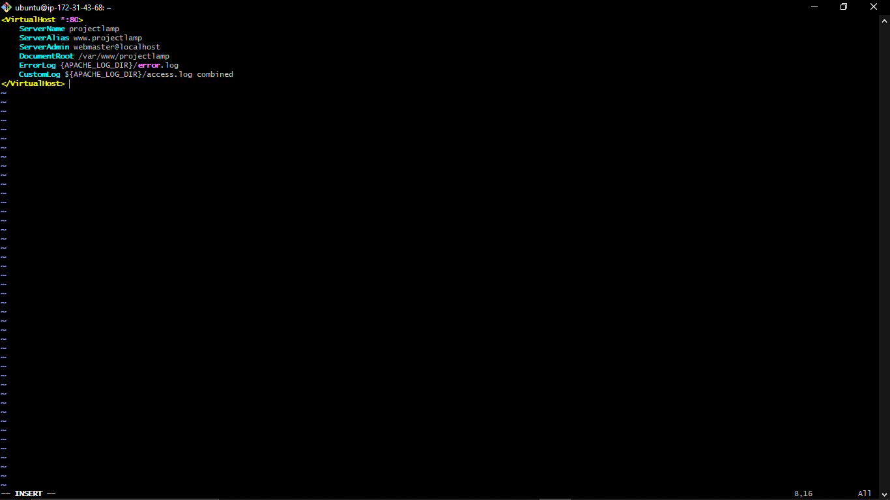

You can use the ls command to show the new file in the sites-available directory  
`sudo ls /etc/apache2/sites-available`

You will see something like this;  
`000-default.conf default-ssl.conf projectlamp.conf`

* **With this VirtualHost configuration, we’re telling Apache to serve projectlamp using `/var/www/projectlamp` as its web root directory. If you would like to test Apache without a domain name, you can remove or comment out the options ServerName and ServerAlias by adding a `#` character in the beginning of each option’s lines. Adding the `#` character there will tell the program to skip processing the instructions on those lines. You can now use a2ensite command to enable the new virtual host:**

`sudo a2ensite projectlamp`

* **You might want to disable the default website that comes installed with Apache. This is required if you’re not using a custom domain name, because in this case Apache’s default configuration would overwrite your virtual host.**  
`sudo a2dissite 000-default`

    **To disable Apache’s default website use a2dissite command, type:**  
`sudo a2dissite 000-default`

    **To make sure your configuration file doesn’t contain syntax errors, run:**  
`sudo apache2ctl configtest`

    **Finally, restart Apache so these changes take effect:**  
`sudo systemctl restart apache2`
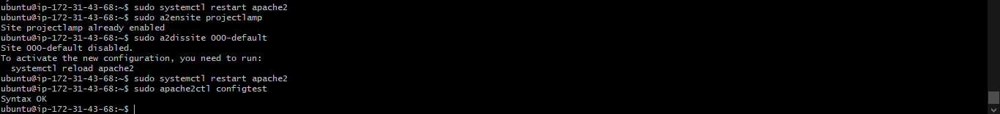

Your new website is now active, but the web root `/var/www/projectlamp` is still empty. Create an `index.html` file in that location so that we can test that the virtual host works as expected:

  <pre>
<code id="lampCommand">
sudo echo 'Hello LAMP from hostname' $(curl -s http://169.254.169.254/latest/meta-data/public-hostname) 'with public IP' $(curl -s http://169.254.169.254/latest/meta-data/public-ipv4) > /var/www/projectlamp/index.html
</code>
  </pre>
  <button onclick="copyLAMPCommand()" title="Copy to clipboard" style="position: absolute; top: 10px; right: 10px; cursor: pointer;">📋</button>

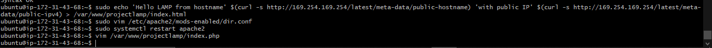

Now go to your browser and try to open your website URL using IP address:  
 <http://:80>
  
You can see the text "Hello LAMP from hostname" as in the command above.

## Step 6: Enable PHP on the Website
With the default DirectoryIndex settings on Apache, a file named `index.html` will always take precedence over an `index.php file.` This is useful for setting up maintenance pages in PHP applications, by creating a temporary `index.html` file containing an informative message to visitors. Because this page will take precedence over the `index.php` page, it will then become the landing page for the application. Once maintenance is over, the `index.html` is renamed or removed from the document root, bringing back the regular application page. In case you want to change this behavior, you’ll need to edit the `/etc/apache2/mods-enabled/dir.conf` file and change the order in which the `index.php file` is listed within the `DirectoryIndex directive`:   
 `sudo vim /etc/apache2/mods-enabled/dir.conf`

  <button onclick="navigator.clipboard.writeText(`<IfModule mod_dir.c>
    #Change this:
    #DirectoryIndex index.html index.cgi index.pl index.php index.xhtml index.htm
    #To this:
    DirectoryIndex index.php index.html index.cgi index.pl index.xhtml index.htm
</IfModule>`)" 
  style="position: absolute; top: 10px; right: 10px; background: transparent; border: none; color: #ccc; font-size: 16px; cursor: pointer;" title="Copy to clipboard">📋</button>

  <pre style="margin: 0;"><code>&lt;IfModule mod_dir.c&gt;
    #Change this:
    #DirectoryIndex index.html index.cgi index.pl index.php index.xhtml index.htm
    #To this:
    DirectoryIndex index.php index.html index.cgi index.pl index.xhtml index.htm
&lt;/IfModule&gt;
</code></pre>

**After saving and closing the file, you will need to reload Apache so the changes take effect:**  
`sudo systemctl reload apache2`

**Finally, we will create a PHP script to test that PHP is correctly installed and configured on your server. Now that you have a custom location to host your website’s files and folders, we’ll create a PHP test script to confirm that Apache is able to handle and process requests for PHP files. Create a new file named `index.php` inside your custom web root folder:**  
`vim /var/www/projectlamp/index.php`

T**his will open a blank file. Add the following text, which is valid PHP code, inside the file:**  
 `.<?php phpinfo();`

**When you are finished, save and close the file, refresh the page and you will see a page similar to this:**
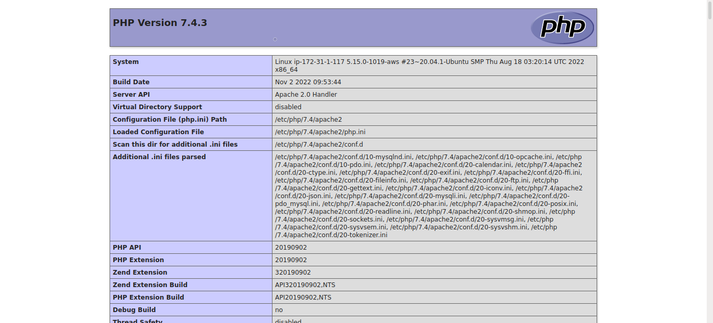

**This page provides information about your server from the perspective of PHP. It is useful for debugging and to ensure that your settings are being applied correctly. If you can see this page in your browser, then your PHP installation is working as expected. After checking the relevant information about your PHP server through that page, it’s best to remove the file you created as it contains sensitive information about your PHP environment -and your Ubuntu server. You can use rm to do so:**   
**`sudo rm /var/www/projectlamp/index.php` You can always recreate this page if you need to access the information again later.**

##  Congratulations, you have successfully hosted your LAMP server on AWS